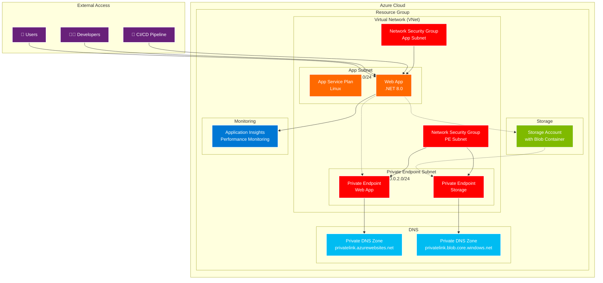

# Todo List Application - Infrastructure as Code (IAC)

Este documento descreve a infraestrutura como código (IAC) implementada para a aplicação Todo List usando Terraform no Microsoft Azure.

## 📋 Visão Geral

A infraestrutura foi projetada seguindo as melhores práticas de segurança e escalabilidade, utilizando uma arquitetura de rede privada com endpoints privados, integração VNet e configurações de segurança robustas.

## 🏗️ Arquitetura da Infraestrutura



## 🎯 Componentes da Infraestrutura

### 🌐 Rede (Networking Module)
- **Virtual Network (VNet)**: Rede isolada com espaço de endereços 10.0.0.0/16
- **App Subnet**: Sub-rede para recursos da aplicação (10.0.1.0/24)
- **Private Endpoint Subnet**: Sub-rede para endpoints privados (10.0.2.0/24)
- **Network Security Groups (NSGs)**: Regras de firewall para controle de tráfego
- **Private DNS Zones**: Resolução DNS para endpoints privados

### 💻 Aplicação (App Service Module)
- **App Service Plan**: Plano de hospedagem Linux com .NET 8.0
- **Web App**: Aplicação ASP.NET Core com integração VNet
- **Application Insights**: Monitoramento de performance e telemetria
- **Managed Identity**: Identidade gerenciada para acesso seguro a recursos

### 🗄️ Armazenamento (Storage Module)
- **Storage Account**: Conta de armazenamento com criptografia
- **Blob Container**: Contêiner para arquivos da aplicação
- **Private Endpoint**: Acesso privado ao storage via VNet

### 🔒 Segurança
- **HTTPS Only**: Força uso de HTTPS em toda comunicação
- **TLS 1.2+**: Versão mínima do protocolo TLS
- **Network Isolation**: Tráfego isolado dentro da VNet
- **IP Restrictions**: Controle de acesso por endereço IP
- **Private Endpoints**: Acesso privado aos serviços Azure

## 📁 Estrutura do Projeto Terraform

```
terraform/
├── main.tf                    # Configuração principal
├── variables.tf               # Definição de variáveis
├── outputs.tf                 # Outputs da infraestrutura
├── locals.tf                  # Valores locais
├── terraform.tf               # Configuração do Terraform
├── external-vars.tfvars       # Variáveis externas (produção)
├── environments/              # Configurações por ambiente
│   ├── dev.tfvars            # Ambiente de desenvolvimento
│   └── staging.tfvars        # Ambiente de homologação
├── modules/                   # Módulos reutilizáveis
│   ├── networking/           # Módulo de rede
│   │   ├── main.tf
│   │   ├── variables.tf
│   │   └── outputs.tf
│   ├── app_service/          # Módulo do App Service
│   │   ├── main.tf
│   │   ├── variables.tf
│   │   └── outputs.tf
│   └── storage/              # Módulo de armazenamento
│       ├── main.tf
│       ├── variables.tf
│       └── outputs.tf
└── scripts/                  # Scripts de automação
    ├── deploy.sh             # Script de deploy
    └── destroy.sh            # Script de destruição
```

## 🚀 Como Usar

### Pré-requisitos
- [Terraform](https://www.terraform.io/downloads) >= 1.0
- [Azure CLI](https://docs.microsoft.com/cli/azure/install-azure-cli) configurado
- Conta Azure com permissões adequadas

### 1. Configurar Autenticação Azure
```bash
# Login no Azure
az login

# Definir subscription (se necessário)
az account set --subscription "sua-subscription-id"
```

### 2. Configurar Variáveis
Edite o arquivo `external-vars.tfvars` ou use os arquivos de ambiente específicos:

```bash
# Para produção
cp external-vars.tfvars my-vars.tfvars
# Edite my-vars.tfvars com seus valores

# Para desenvolvimento
# Use environments/dev.tfvars
```

### 3. Deploy da Infraestrutura

#### Opção 1: Usando Script Automatizado
```bash
# Deploy para produção
./scripts/deploy.sh production

# Deploy para desenvolvimento
./scripts/deploy.sh dev

# Deploy para homologação
./scripts/deploy.sh staging
```

#### Opção 2: Comandos Terraform Manuais
```bash
# Inicializar Terraform
terraform init

# Planejar deployment
terraform plan -var-file="external-vars.tfvars"

# Aplicar mudanças
terraform apply -var-file="external-vars.tfvars"
```

### 4. Verificar Outputs
Após o deployment, use o comando para visualizar as informações importantes:

```bash
terraform output
```

## 🌍 Ambientes

### 🧪 Development
- **SKU**: F1 (Free)
- **Private Endpoints**: Desabilitado (economia)
- **HTTPS**: Opcional
- **Replicação**: LRS

### 🎭 Staging
- **SKU**: B1 (Basic)
- **Private Endpoints**: Habilitado
- **HTTPS**: Obrigatório
- **Replicação**: GRS

### 🏭 Production
- **SKU**: B1+ (configurável)
- **Private Endpoints**: Habilitado
- **HTTPS**: Obrigatório
- **Replicação**: GRS/RA-GRS

## 🔧 Configurações Avançadas

### Backend Remoto (Recomendado para Produção)
Configure o backend do Terraform para armazenar o state remotamente:

```hcl
# No arquivo terraform.tf, descomente e configure:
backend "azurerm" {
  resource_group_name  = "rg-terraform-state"
  storage_account_name = "sttfstatexxxxxx"
  container_name       = "tfstate"
  key                  = "todolist/terraform.tfstate"
}
```

### Variáveis de Ambiente Sensíveis
Use variáveis de ambiente para valores sensíveis:

```bash
export TF_VAR_admin_password="sua-senha-secreta"
export TF_VAR_certificate_password="senha-certificado"
```

## 📊 Monitoramento e Observabilidade

### Application Insights
- Performance monitoring automático
- Logs de aplicação centralizados
- Métricas de usuário e sistema
- Alertas configuráveis

### Acesso aos Logs
```bash
# Via Azure CLI
az monitor app-insights query \
  --app "ai-todolist-api-production" \
  --analytics-query "requests | limit 10"
```

## 🛡️ Segurança

### Melhores Práticas Implementadas
- ✅ Network isolation com VNet
- ✅ Private endpoints para todos os serviços
- ✅ HTTPS obrigatório
- ✅ TLS 1.2+ mínimo
- ✅ Managed Identity para autenticação
- ✅ Network Security Groups com regras restritivas
- ✅ Storage account com acesso negado por padrão
- ✅ Logs de auditoria habilitados

### Recomendações Adicionais
- Configure Azure Key Vault para segredos
- Implemente Azure Policy para governance
- Configure alertas de segurança
- Use Azure Defender para proteção avançada

## 🚨 Troubleshooting

### Problemas Comuns

#### 1. Erro de Nome Duplicado
```
Error: Storage account name already exists
```
**Solução**: O nome da storage account deve ser globalmente único. Modifique o `random_string.storage_suffix`.

#### 2. Quota Excedida
```
Error: Quota exceeded for App Service Plans
```
**Solução**: Verifique os limites da sua subscription Azure ou use uma região diferente.

#### 3. Permissões Insuficientes
```
Error: Authorization failed
```
**Solução**: Certifique-se de ter as permissões necessárias (Contributor ou Owner) na subscription.

### Comandos Úteis para Debug

```bash
# Verificar state atual
terraform state list

# Ver detalhes de um recurso
terraform state show azurerm_linux_web_app.main

# Refresh do state
terraform refresh -var-file="external-vars.tfvars"

# Importar recurso existente
terraform import azurerm_resource_group.main /subscriptions/.../resourceGroups/...
```

## 🧹 Limpeza

### Destruir Infraestrutura
```bash
# Usando script (recomendado)
./scripts/destroy.sh production

# Ou manualmente
terraform destroy -var-file="external-vars.tfvars"
```

⚠️ **ATENÇÃO**: A destruição é irreversível. Faça backup de dados importantes antes de prosseguir.

## 📚 Referências

- [Terraform Azure Provider](https://registry.terraform.io/providers/hashicorp/azurerm/latest/docs)
- [Azure App Service](https://docs.microsoft.com/azure/app-service/)
- [Azure Virtual Network](https://docs.microsoft.com/azure/virtual-network/)
- [Azure Private Link](https://docs.microsoft.com/azure/private-link/)
- [Azure Application Insights](https://docs.microsoft.com/azure/azure-monitor/app/app-insights-overview)

## 🤝 Contribuição

Para contribuir com melhorias na infraestrutura:

1. Faça um fork do repositório
2. Crie uma branch para suas mudanças
3. Teste as modificações em ambiente de desenvolvimento
4. Submeta um pull request com descrição detalhada

---

🎉 **Pronto!** Sua infraestrutura Todo List está configurada e pronta para uso!